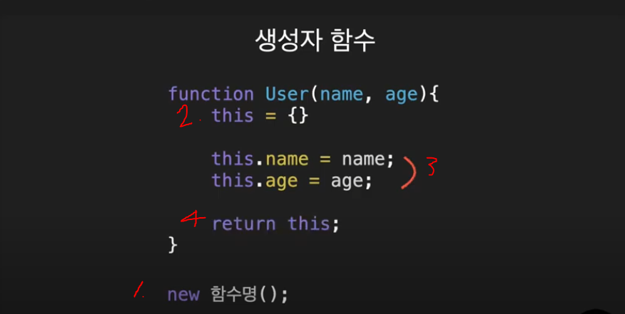
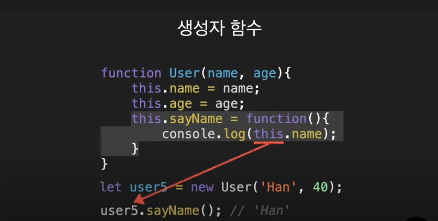

# 생성자 함수

```
출처: https://www.youtube.com/watch?v=8hrSkOihmBI&list=PLZKTXPmaJk8JZ2NAC538UzhY_UNqMdZB4&index=2
```

보통 아래와 같이 객체를 만든다.

    ```
    // 객체 리터럴
    let user = {
        name: 'Mike',
        age: 30
    }
    ```

하지만, 개발을 하다보면 같은 형태의 객체를 여러개 만들어야 할 경우가 생긴다.

ex) 회원, 상품, ...
이럴 때 사용하는것이 생성자 함수이다.

    ```
    // 첫글자는 대문자로 한다. (관례)
    function User(name, age){
        this.name = name;
        this.age = age;
    }

    // new 연산자를 사용해서 호출
    let user1 = new User('Mike', 30);
    let user2 = new User('Jane', 22);
    let user3 = new User('Tom', 17);
    ```

실생활에서 볼 수 있는 붕어빵 틀이나 와플기계라고 생각하면 된다.

## 생성자 함수의 동작 과정


1. new 함수명() 호출
2. 빈객체 생성 후 this에 할당. this = {}
3. 함수안의 코드를 실행하면서 this에 프로퍼티들을 추가
4. 마지막으로 this를 반환

-   2,4 번은 실제로 코드상엔 존재하지 않고
    new 를 붙여서 호출 시 2,4 번이 포함된 방식으로 알고리즘이 동작.

## 생성자 함수 사용시의 장점

1. 일일이 객체리터럴로 객체를 만드는것보다 훨씬 빠르고 일관성있게 객체생성 가능
2. 스펙이 변경되어도 생성자 함수만 수정해주면 된다.

## 기타

1. 어떠한 함수라도 new 연산자를 붙여서 실행하면 생성자 함수의 동작과정 2,4 번의 알고리즘이 동작함.
2. this binding
   
