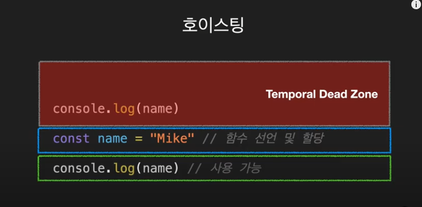

# 변수

-   Javascript는 문법의 대부분을 Java와 C, C++로 부터 차용하고 있으며, Awk, Perl, Python의 영향도 받았다.

-   Javascript는 대소문자를 구별하며 유니코드 문자셋을 이용한다.

## 변수의 선언

선언에는 3가지 방법이 있다.

-   var
-   let
-   const

## var

-   변수를 선언. 추가로 동시에 값을 초기화
-   지역 및 전역 변수를 선언하는데 모두 사용될 수 있다.
-   한번 선언된 변수를 다시 선언할 수 있다.

    ```
    var name = "Mike";
    console.log(name); // Mike

    var name = "Jane";
    console.log(name); // Jane
    ```

-   선언하기 전에 사용할 수 있다. (var 로 선언된 모든것들은 코드가 실행되기 전 맨 위로 끌어올려진 것 처럼 동작한다. 이것을 <b>호이스팅</b> 이라고 한다)

        ```
        console.log(name); // undefined
        var name = "Mike";
        ```

    위의 예제에서 undefined 가 나오는 이유는 선언은 되었지만, 할당은 되지 않았기 때문이다.
    위 코드는 아래와 같이 동작한다.

        ```
        var name;
        console.log(name); // undefined
        name = "Mike"; // 할당
        ```

## let

-   블록범위 지역 변수를 선언. 추가로 동시에 값을 초기화
-   한번 선언된 변수를 다시 선언할 수 없다.

    ```
    var name = "Mike";
    console.log(name); // Mike

    var name = "Jane";
    console.log(name); // error! (Uncaught SyntaxError: Identifier 'name' has already been declared)
    ```

-   선언하기 전에 사용할 수 없다.
    ```
    console.log(name); // ReferenceError
    let name = "Mike";
    ```
    let과 const 도 호이스팅이 되지만 Temporal Dead Zone 이라는 영역에 영향을 받기 때문에 에러가 난다.
    
    <b>TDZ는 코드를 예측 가능</b>하게 하고 <b>잠재적인 버그를 줄일 수 있다.</b>

## const

-   읽기전용 상수를 만들 수 있다.
-   상수는 스크립트가 실행 중인 동안 대입을 통해 값을 바꾸거나 재선언 될 수 없다. 값으로 초기화 해야 한다.
-   범위 규칙은 let 블록 범위 변수와 동일하다.
-   상수에 할당된 객체의 속성은 보호되지 않아서 다음의 구문은 문제없이 실행된다.

    ```
    const MY_OBJECT = {'key': 'value'};
    MY_OBJECT.key = 'otherValue';
    ```

    배열도 마찬가지

    ```
    const MY_ARRAY = ['HTML','CSS'];
    MY_ARRAY.push('JAVASCRIPT');
    console.log(MY_ARRAY); //logs ['HTML','CSS','JAVASCRIPT'];
    ```

## 호이스팅

스코프 내부 어디서든 변수 선언은 최상위에 선언된 것 처럼 행동

## 변수의 생성과정

1. 선언단계
2. 초기화 단계
3. 할당 단계

### var

-   var 는 선언과 초기화가 동시에 실행됨
-   따라서 할당 전 호출해도 에러가 나지않고 undefined 값으로 찍힘

### let

-   let 은 선언단계와 초기화 단계가 따로 진행됨
-   호이스팅되어 선언단계가 이루어지지만, 초기화는 실제 코드에 도달했을 때 이루어지기 때문에 참조에러가 나는 것.

### const

-   선언 + 초기화 + 할당이 동시에 되어야 한다.

    ```
    let name;
    name = 'Mike';

    var age;
    age = 30;

    const gender;
    gender = 'male'; // error!: Uncaught SyntaxError: Missing initializer in const declaration
    ```

## 스코프

'범위' 라는 뜻을 가지고 있다. 즉, '변수에 접근할 수 있는 범위' 이다.

### var

-   함수 스코프(function-scoped)
-   함수 내에서 선언한 변수만 지역변수가 됨

    ```
    const age = 30;
    if(age > 19) {
        var txt = '성인';
    }
    console.log(txt); // '성인'
    ```

    -   var가 유일하게 벗어날 수 없는 Scope 는 함수라고 생각하면 된다.

    ```
    function add(num1, num2) {
        var result = num + num2;
    }

    add(2,3);
    console.log(result); // error! : Uncaught ReferenceError: result is not defined
    ```

### let, const

-   블록 스코프(block-scoped)
-   블록: 함수, if문, for 문, while 문, try/catch 문, ...
